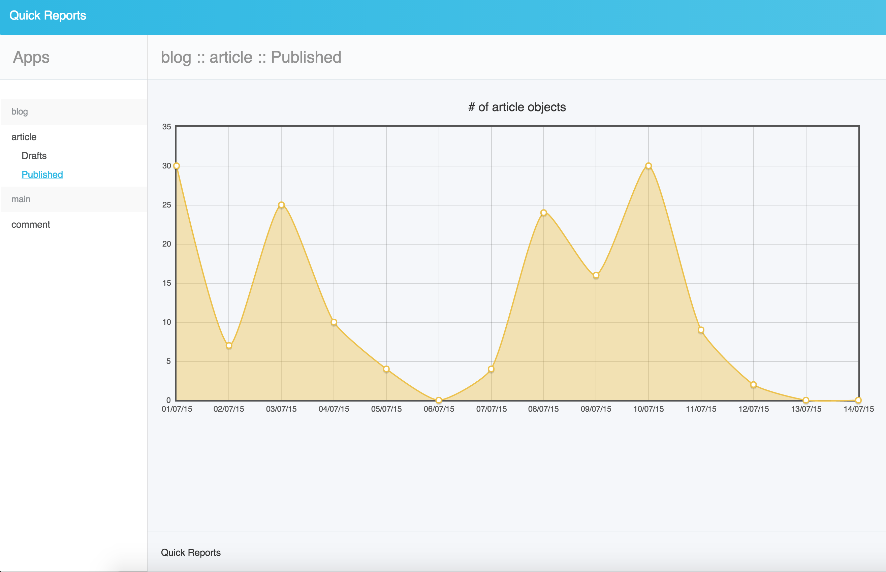

QuickReport Model Fields
========================

.. toctree::

date_field
----------

`DateTimeField` of your model which is set automatically when new object is created.

report_set
----------

List of reports of a model. For each report in a model, you should define a unique name and a `Q objects`.

- `name`: Unique report name of related model
- `query`: Django `Q objects`.

For example,

.. literalinclude:: modelfields.py
   :language: python

