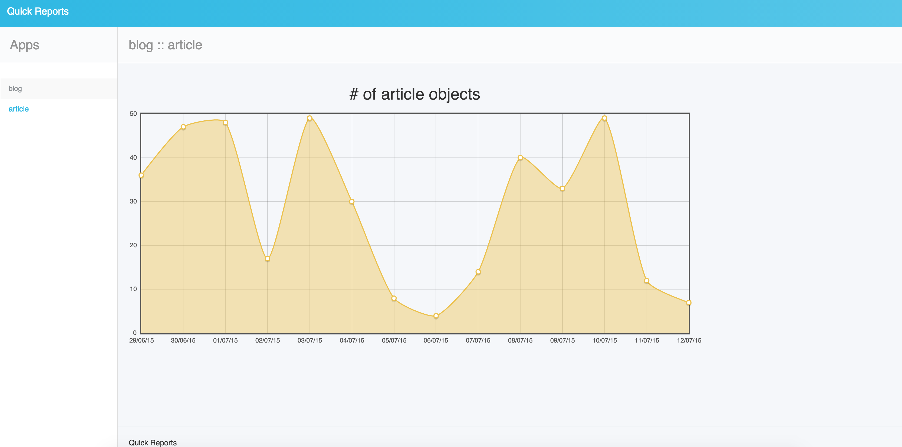

Quickstart
==========

.. toctree::

After you install the package and update your ``settings`` and ``urls`` files, let create a simple report.

For example, you have an ``Article`` model and you'd like to know how many new articles created each day.
Add ``QuickReport`` inner class to your model as below.

.. literalinclude:: model.py
   :language: python

Visit ``http://example.com/reports/`` and find your model in left sidebar.
If you click on that, you will see the chart similar to below

